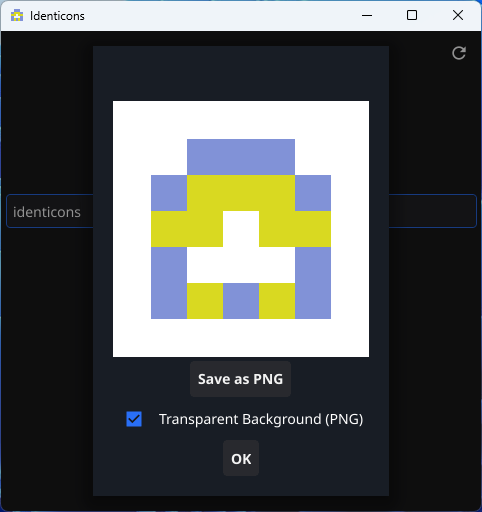

## Identicons — Standalone Generator

A beautiful, deterministic identicon generator for keys, text, passwords,
and more.

## What are Identicons?

Identicons are visual representations of data — often used to represent
cryptographic keys, user IDs, or hashes in a human-friendly way.
They help you visually verify that two keys or inputs are the same —
without comparing long strings of characters.

This tool generates minimalist, colorful, symmetric 5×5 identicons with
billions of possible variations — all deterministic (same input → same identicon).

## Features

🔹 Deterministic — same input always produces the same identicon  
🔹 Billions of variations — unique visuals even for similar inputs  
🔹 Two-color layers — rich, layered visuals without clutter  
🔹 Dark/Light theme support — adapts to your system  
🔹 Export as PNG — with transparent or white background  
🔹 Export as Face: header — with transparent or white Background

## How to Use

Enter any text in the input field — e.g.:  
A password: mySecret123  
A file hash: a1b2c3d4...  
A public key (hex): 302a300506032b6570032100...  
A name: alice@example.com  
Click “Generate Identicon” → your unique visual fingerprint appears.  
(Optional) Check “Transparent Background” and click “Save as PNG” to export.  
(Optional) Click "Save as Face Header" for Usenet postings or emails.  

